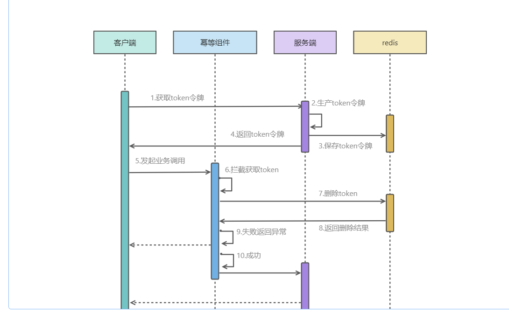
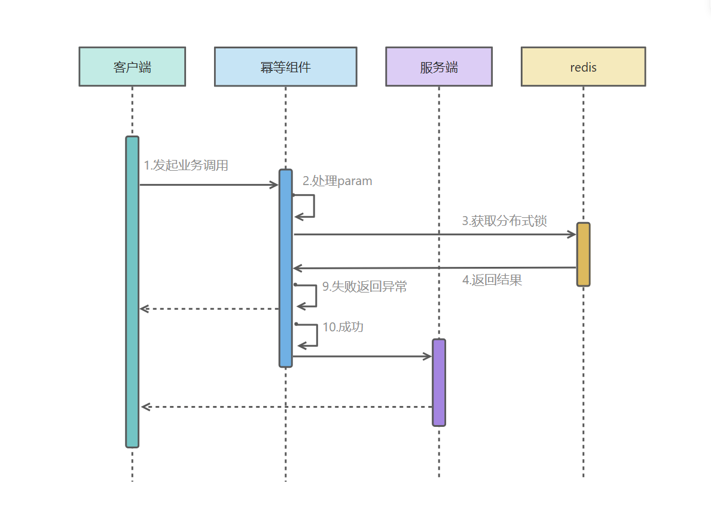
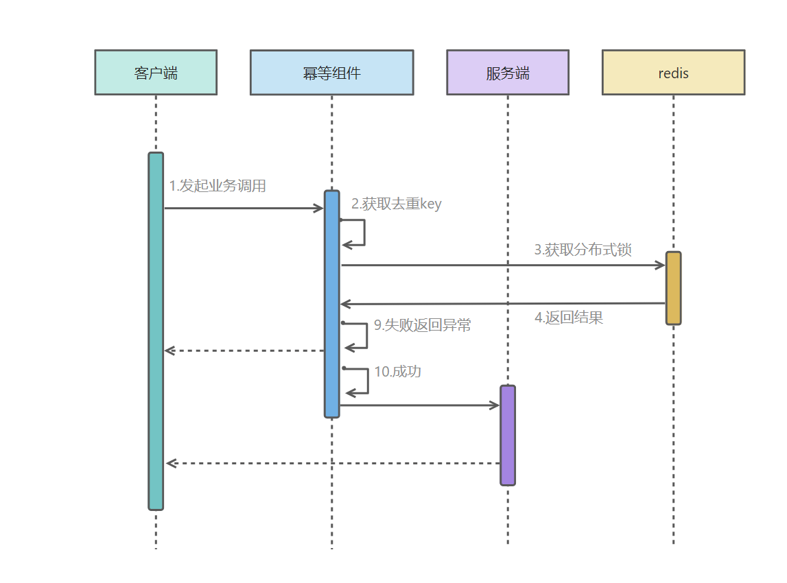

# dorol
分布式常见的生产级技术、业务组件，帮助广大开发者提升生产效率。
### 幂等性组件  
#### 幂等性的定义（来自百度）
幂等性（Idempotence）‌是一个数学与计算机科学中的概念，指的是一个操作或函数在其多次执行后产生的影响与
一次执行的影响相同。在计算机编程中，幂等操作意味着无论该操作执行多少次，对系统状态的影响都是一样的，不
会因为重复执行而产生额外的副作用。‌  

#### 为什么要做幂等性处理
如果不做防重复提交或者幂等，可能会导致以下问题：  
1、restfull接口重复提交、重复操作问题，造成数据重复和逻辑错误。  
2、MQ消息重复消费，造成数据重复和逻辑错误。

#### 哪些接口需要做幂等性
select/delete类型接口天生幂等，不需要做幂等性处理。  
add类型接口会造成数据重复，需要做幂等性。  
update类型接口某些场景下会造成数据逻辑错误（如重复扣款），需依据情况做幂等性处理。  

#### 解决幂等性问题方案
**Token令牌**  
为了防止重复操作，客户端在第一次调用业务请求会发送一个获取Token令牌的请求（具备唯一性）， 服务端生成Token并作为key保存在redis缓存中。
客户端发起业务请求的时候把Token令牌通过heard或者param传过来，服务端幂等组件获取Token去缓存执行删除操作，
如果成功说明存在允许执行，如果不成功说明已经执行过或者token不合法，返回异常提示。

**请求参数去重**  
用户提交请求的时候，幂等组件拦截接口请求参数通过MD5加密获取一个唯一key(如害怕key发生重复可采取key=
userid+MD5的方式降低重复概率)，然后把key作为分布式锁key，请求在业务处理前会先尝试获取锁，如果获取成功说明是第一次操作，如果获取失败说明是重复操作
（这里说的重复操作可以理解为某个时间内的重复行为，可根据业务情况设定分布式锁过期时间）。  

**去重表**  
去重表是指在使用 Redis 或者 MySQL 作为存储时，为了实现幂等性而用于记录已经处理过的请求记录，以防止重复执行。当客户端发送请求时，
服务端会先查询 Redis/MYSQL 去重表来检查该请求是否已经被处理过。如果在存在对应的记录，表示请求已经执行过，服务端可以直接返回之，
而不再执行重复操作。如果在不存在对应的记录，表示请求是新的，服务端会执行相应的业务逻辑，并在处理完成后将请求的唯一标识（如请求 ID 
或标识）添加到 Redis 去重表中，以便后续的重复请求可以被正确识别和处理
。为了避免并发问题去重表一般是在redis以分布式方式实现（相同的标识只能抢到一把锁）。  

### 敏感消息组件
### 数据治理组件